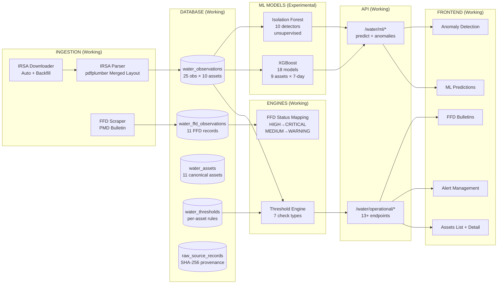
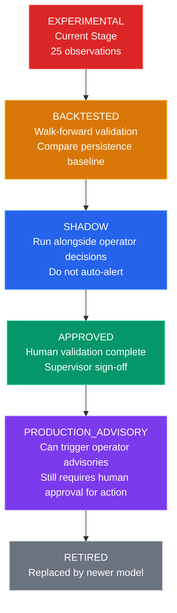

# IBCP-SCADA System Architecture

## Complete Layer Architecture

```mermaid
flowchart TB
    subgraph FIELD["FIELD / PHYSICAL PROCESS LAYER"]
        SENSORS["Sensors<br/>Level • Flow • Rainfall • Gate Position"]
        ACTUATORS["Actuators<br/>Gates • Pumps • Valves"]
        SENSORS --> ACTUATORS
    end

    subgraph CONTROL["OT CONTROL LAYER"]
        PLC["PLCs<br/>Local Logic • Interlocks • Safety"]
        RTU["RTUs<br/>Remote Telemetry • Local Control"]
        GCTRL["Gate Controllers"]
        PCTRL["Pump Controllers"]

        SENSORS --> PLC
        SENSORS --> RTU
        PLC --> GCTRL
        PLC --> PCTRL
        RTU --> GCTRL
        RTU --> PCTRL
        GCTRL --> ACTUATORS
        PCTRL --> ACTUATORS
    end

    subgraph SCADA_L["SCADA OPERATIONS LAYER"]
        SCADASRV["SCADA Servers"]
        HMI["HMIs / Operator Workstations"]
        HIST["Industrial Historian"]
        ALARM["SCADA Alarm Server"]

        PLC --> SCADASRV
        RTU --> SCADASRV
        SCADASRV --> HMI
        SCADASRV --> HIST
        SCADASRV --> ALARM
    end

    subgraph DMZ["INDUSTRIAL DMZ / INTEGRATION BOUNDARY"]
        COLLECTOR["Read-only OT Data Collector"]
        REPLICA["Historian Replica"]
        OPC["Read-only OPC UA Gateway"]
        BROKER["Message Broker"]
        OTAPI["OT Integration API"]

        HIST --> REPLICA
        SCADASRV --> COLLECTOR
        OPC --> COLLECTOR
        COLLECTOR --> BROKER
        REPLICA --> OTAPI
        BROKER --> OTAPI
    end

    subgraph SOURCES["EXTERNAL DATA SOURCES"]
        IRSA_S["IRSA<br/>Daily PDF / Official Data"]
        FFD_S["PMD/FFD<br/>Bulletins • River Status • Forecasts"]
        GEE_S["Google Earth Engine<br/>Rainfall • ET • NDVI • Flood Features"]
        PBS_S["PBS Census<br/>Population / Settlements"]
        PDMA_S["PDMA / NDMA<br/>Hazard Maps • Emergency Data"]
    end

    subgraph APP["APPLICATION PLATFORM"]
        INGEST["Ingestion Services"]
        NORMALIZE["Validation & Normalization"]
        ASSET["Asset & Geography Registry"]
        OBS["Observation Store"]
        TIMESERIES["Time-Series Store"]
        ALERTS["Threshold & Alert Engine"]
        ML["ML / Forecasting"]
        IMPACT["Downstream Impact & GIS"]
        WORKFLOW["Operational Workflow"]
        REPORTS["Reports & Exports"]
        AUDIT["Audit Log"]

        OTAPI --> INGEST
        IRSA_S --> INGEST
        FFD_S --> INGEST
        GEE_S --> INGEST
        PBS_S --> INGEST
        PDMA_S --> INGEST

        INGEST --> NORMALIZE
        NORMALIZE --> OBS
        NORMALIZE --> TIMESERIES
        ASSET --> NORMALIZE
        OBS --> ALERTS
        OBS --> ML
        OBS --> IMPACT
        ML --> ALERTS
        IMPACT --> ALERTS
        ALERTS --> WORKFLOW
        WORKFLOW --> AUDIT
        REPORTS --> AUDIT
    end

    subgraph IDENTITY["IDENTITY / SECURITY / ADMIN"]
        IAM["Identity Provider<br/>Login • MFA • Sessions"]
        RBAC["RBAC / ABAC<br/>Roles • Portals • Regions • Assets"]
        ADMIN["Admin Services<br/>Users • Thresholds • Sources"]
        OBSERVABILITY["Monitoring<br/>Pipeline Runs • Health • Logs"]
    end

    subgraph PORTALS["APPLICATION PORTALS"]
        AQUA["AquaVision<br/>Water Operations"]
        CROP["CropVision<br/>Crops & Irrigation"]
        SOIL["SoilVision<br/>Soil & Moisture"]
        LAND["LandVision<br/>GIS & Land"]
        SUP["Supervisor Portal"]
        PUBLIC["Public / Emergency View"]
    end

    APP --> AQUA
    APP --> CROP
    APP --> SOIL
    APP --> LAND
    APP --> SUP
    ALERTS --> PUBLIC

    IAM --> RBAC
    RBAC --> PORTALS
    ADMIN --> IAM
    ADMIN --> RBAC
    ADMIN --> OBSERVABILITY
    APP --> OBSERVABILITY

    style FIELD fill:#1e3a5f,stroke:#3b82f6,color:#fff
    style CONTROL fill:#7c2d12,stroke:#ea580c,color:#fff
    style SCADA_L fill:#581c87,stroke:#a855f7,color:#fff
    style DMZ fill:#854d0e,stroke:#eab308,color:#fff
    style SOURCES fill:#065f46,stroke:#10b981,color:#fff
    style APP fill:#1e40af,stroke:#3b82f6,color:#fff
    style IDENTITY fill:#991b1b,stroke:#ef4444,color:#fff
    style PORTALS fill:#0f766e,stroke:#14b8a6,color:#fff
```



---

## What We Have Built (Application Layer)



---

## Data Status Classification

Every observation MUST carry a clear data status so operators never confuse a model forecast with an official measurement.

| Status | Meaning | Example |
|--------|---------|---------|
| `OBSERVED_OFFICIAL` | Official measurement from authority | IRSA PDF level reading |
| `OBSERVED_TELEMETRY` | Real-time sensor data from SCADA | Gauge telemetry |
| `ESTIMATED_GEE` | Satellite-derived estimate | CHIRPS rainfall, MOD16 ET |
| `FORECAST_FFD` | Forecast from official bulletin | FFD 24h/48h forecast |
| `MODEL_PREDICTION` | ML model output | XGBoost 7-day prediction |
| `SIMULATED` | What-if scenario | RL release optimization |
| `STALE` | No update within expected window | 48h no IRSA update |
| `INVALID` | Failed quality checks | Negative inflow value |

### Example: Tarbela Level

```
Tarbela water_level_ft:
  value: 1542.3
  status: OBSERVED_OFFICIAL
  source: IRSA PDF
  observed_at: 2026-08-15T00:00:00Z
  provenance_hash: sha256:abc123...

Tarbela predicted_level_7d:
  value: 1548.7
  status: MODEL_PREDICTION
  model: xgb-v1.0
  confidence: 0.85
  predicted_at: 2026-08-16T00:00:00Z

Tarbela rainfall_24h:
  value: 12.4mm
  status: ESTIMATED_GEE
  source: CHIRPS
```

---

## SCADA Alarms vs Application Alerts

These are **related but not identical**. Must be kept separate.

| Aspect | SCADA Alarm | Application Alert |
|--------|-------------|-------------------|
| **Created by** | OT control system | AquaVision threshold engine |
| **Source** | PLC/RTU/Historian | IRSA, FFD, GEE, Rules, Models |
| **Latency** | Real-time (ms-sec) | Minutes to hours |
| **Action** | Immediate OT response | Operator review + workflow |
| **Severity** | Safety-critical | Operational advisory |
| **Lifecycle** | Auto-ack on clearance | Manual ack + resolution |

### Application Alert Origin Types

```
source_type:
  SCADA     - From OT system (future DMZ integration)
  IRSA      - From IRSA PDF ingestion
  FFD       - From PMD/FFD bulletin
  GEE       - From Google Earth Engine features
  RULE      - From threshold engine rules
  MODEL     - From ML model predictions
  DATA_QUALITY - From validation checks
```

---

## ML Model Lifecycle

Current models are **experimental**. Do NOT let them independently trigger critical operational actions.



### Current Model Status

| Model | Type | Status | Notes |
|-------|------|--------|-------|
| XGBoost Flood | Supervised | EXPERIMENTAL | 25 obs/asset, needs 2-3 years |
| Isolation Forest | Unsupervised | EXPERIMENTAL | Good for anomaly support |
| LSTM Travel Time | Supervised | NOT STARTED | Needs 12+ months paired hourly data |
| NLP Bulletin | Rule-based | NOT STARTED | Automate FFD extraction |
| U-Net Flood Extent | Supervised | NOT STARTED | Needs labeled satellite imagery |
| RL Reservoir Opt. | Reinforcement | NOT STARTED | Needs validated simulation environment |

### Model Registry (To Add)

```
model_version: xgb-v1.0
feature_version: feat-v1.0
training_start: 2026-07-22
training_end: 2026-08-15
training_cutoff: 2026-08-14
asset_scope: [1,2,3,4,5,6,7,8,9,11]
horizon_days: 7
training_rows: 25
validation_metrics: {mae: null, rmse: null, r2: null}
test_metrics: {mae: null, rmse: null, r2: null}
approved_by: null
deployment_status: EXPERIMENTAL
```

---

## Revised Priority Order

```mermaid
flowchart TD
    P1["Phase 1: Stabilize<br/>IRSA/FFD ingestion<br/>Scheduler health<br/>Data quality checks"]
    P2["Phase 2: Threshold & Alert Workflow<br/>Complete alert states<br/>Deduplication<br/>Supervisor escalation"]
    P3["Phase 3: Data Quality & Provenance<br/>Pipeline-run monitoring<br/>Data status classification<br/>Audit logging"]
    P4["Phase 4: ML Validation<br/>Collect 2-3 years data<br/>Walk-forward validation<br/>Shadow mode deployment"]
    P5["Phase 5: GEE Feature Pipeline<br/>CHIRPS rainfall<br/>MOD16 ET<br/>MOD13Q1 NDVI"]
    P6["Phase 6: Downstream Exposure<br/>PBS Census 2023<br/>OpenStreetMap infrastructure<br/>Verified communities"]
    P7["Phase 7: OT Integration<br/>Pilot one asset<br/>Read-only OPC UA<br/>DMZ collector"]
    P8["Phase 8: Hydraulic Modeling<br/>Calibrated flood depth<br/>HEC-RAS or similar<br/>NOT self-built"]
    P9["Phase 9: Public Warning<br/>Approval workflow<br/>Operator → Supervisor → Public<br/>SMS/Emergency integration"]
    P10["Phase 10: Advanced Models<br/>LSTM (when data ready)<br/>U-Net (when imagery ready)<br/>RL (when simulation ready)"]

    P1 --> P2 --> P3 --> P4 --> P5 --> P6 --> P7 --> P8 --> P9 --> P10

    style P1 fill:#dc2626,stroke:#f87171,color:#fff
    style P2 fill:#d97706,stroke:#fbbf24,color:#fff
    style P3 fill:#2563eb,stroke:#60a5fa,color:#fff
    style P4 fill:#059669,stroke:#34d399,color:#fff
    style P5 fill:#7c3aed,stroke:#a78bfa,color:#fff
    style P6 fill:#0891b2,stroke:#22d3ee,color:#fff
    style P7 fill:#c2410c,stroke:#fb923c,color:#fff
    style P6 fill:#0891b2,stroke:#22d3ee,color:#fff
    style P7 fill:#c2410c,stroke:#fb923c,color:#fff
    style P8 fill:#4f46e5,stroke:#818cf8,color:#fff
    style P9 fill:#be123c,stroke:#fb7185,color:#fff
    style P10 fill:#6b21a8,stroke:#c084fc,color:#fff
```



### Phase Details

| Phase | Priority | What | Why |
|-------|----------|------|-----|
| 1 | CRITICAL | Stabilize IRSA/FFD ingestion | Foundation must be solid |
| 2 | HIGH | Complete threshold & alert workflow | Operators need working alerts |
| 3 | HIGH | Data quality & provenance | Trust in data is essential |
| 4 | MEDIUM | ML validation (shadow mode) | Models need 2-3 years data |
| 5 | MEDIUM | GEE feature pipeline | Rainfall + ET + NDVI |
| 6 | MEDIUM | Downstream exposure data | Know who is at risk |
| 7 | LOW | OT integration (DMZ) | Read-only, one pilot asset |
| 8 | LOW | Hydraulic flood depth | Use HEC-RAS, don't build |
| 9 | LOW | Public warning workflow | Operator → Supervisor → Public |
| 10 | RESEARCH | Advanced ML models | LSTM, U-Net, RL when ready |

---

## Architecture Decisions

### 1. No PLC/RTU Control in Application

The application does **NOT** control physical water infrastructure. All PLC/RTU/gate/pump control remains owned and operated by:
- WAPDA (Power)
- IRSA (River Regulations)
- Irrigation Departments
- Dam Authorities
- Other Asset Owners

The application provides **decision support** only.

### 2. Industrial DMZ Required

Direct connection between application and OT networks is **prohibited**. Must use:
- Read-only OT data collector
- Historian replica
- Read-only OPC UA gateway
- Integration API in DMZ

### 3. Operators Use Existing SCADA/HMI

Physical control happens through existing SCADA systems. AquaVision provides:
- Risk advisories
- Forecast information
- Anomaly alerts
- Downstream impact analysis
- Recommended actions (not commands)

### 4. Supervisors Review, Operators Execute

```
Alert → Supervisor Review → Operator Action → SCADA Control
  ↑                                              ↓
  └──────────── Confirmation + Audit ────────────┘
```

### 5. Public Warnings Require Approval

```
ML Prediction → Operator Review → Supervisor Approval → Public Portal
                   ↓                    ↓                     ↓
              Acknowledge          Approve/Reject        SMS/Emergency
```

---

## Recommended Next Steps

### Immediate (Phase 1)
1. Add data-quality checks to ingestion pipeline
2. Add scheduler health monitoring
3. Add pipeline-run logging
4. Verify all IRSA asset mappings
5. Verify FFD units

### Short-term (Phase 2-3)
1. Complete alert workflow (ack → resolve → audit)
2. Add alert deduplication
3. Add data status classification to all observations
4. Add pipeline-run monitoring dashboard

### Medium-term (Phase 4-5)
1. Collect 2-3 years of daily IRSA data
2. Implement walk-forward validation for XGBoost
3. Deploy models in shadow mode
4. Set up GEE service account
5. Extract CHIRPS rainfall data

### Long-term (Phase 6-10)
1. Add PBS Census population data
2. Add OpenStreetMap infrastructure
3. Pilot OT integration with one asset
4. Deploy HEC-RAS for flood depth
5. Build public warning workflow

---

*Generated: 2026-08-16 | Branch: feature/aquavision-ffd-integration*
*Architecture follows NIST/CISA guidelines for ICS security*
